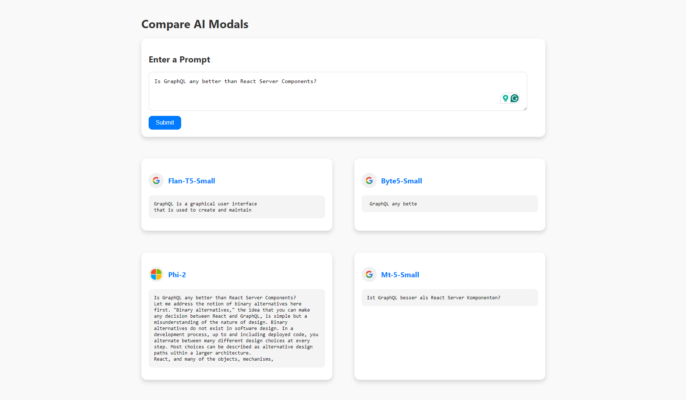

# Compare AI models

This app uses GraphQL to integrate multiple AI models for generating responses from user prompts. Users type a prompt, and the app queries different AI models like Flan-T5, Byte5, Phi2, and MT5. The results are displayed side-by-side for easy comparison. This is ideal for developers, researchers, and AI enthusiasts who want to test and compare different AI models for tasks like text generation and sentiment analysis. The app uses React for the frontend and Apollo Server for the backend, ensuring a fast and smooth user experience.

_📖 Read the full [article here](https://medium.com/@codermo/comparing-ai-model-results-a-dive-into-graphql-vs-react-server-components-facf632ea859)_



### Branches

- [🌿GraphQL branch](https://github.com/mo-sharif/huggingface-ai-compare/tree/feature/rsc-integration)
- [🌿React Server Components branch](https://github.com/mo-sharif/huggingface-ai-compare/tree/feature/graphql-integration)

### Start App

```
cd frontend
npm run start

cd backend
npm run start
```

### App Structure w/ GraphQL

```
my-app/
├── backend/
│   ├── src/
│   │   ├── config/
│   │   │   └── apis.js
│   │   ├── graphql/
│   │   │   ├── resolvers/
│   │   │   │   └── index.js
│   │   │   ├── schemas/
│   │   │   │   └── index.js
│   │   │   └── typeDefs.js
│   │   ├── services/
│   │   │   └── apiRequest.js
│   │   ├── index.js
│   │   └── server.js
│   ├── .env
│   ├── package.json
│   ├── package-lock.json
│   └── README.md
├── frontend/
│   ├── src/
│   │   ├── apollo/
│   │   │   └── client.js
│   │   ├── components/
│   │   │   ├── AIResults.js
│   │   │   └── PromptInput.js
│   │   ├── hooks/
│   │   │   └── useHuggingFaceAPI.js
│   │   ├── pages/
│   │   │   └── App.js
│   │   ├── App.test.js
│   │   ├── index.css
│   │   └── index.js
│   ├── public/
│   │   └── index.html
│   ├── .env
│   ├── package.json
│   ├── package-lock.json
│   ├── README.md
│   └── webpack.config.js
├── .gitignore
├── README.md
└── package.json
```

### Data Flow: Backend to Frontend with GraphQL

#### 1. Frontend

1. **User Interaction**:

   - The user interacts with the `PromptInput` component by typing a prompt and submitting the form.

2. **PromptInput Component**:

   - Captures the user's input and calls a handler function with the prompt.

3. **App Component**:

   - Maintains the state of the prompt.
   - Passes the prompt to the `useHuggingFaceAPI` hook to trigger the GraphQL query.
   - Renders `PromptInput` and `AIResults` components.

4. **useHuggingFaceAPI Hook**:
   - Uses Apollo Client to send the GraphQL query to the backend with the user's prompt.
   - Manages loading and error states.
   - Updates the state with the received data.

#### 2. Backend

1. **API Configurations**:

   - Define API endpoints in a configuration file (e.g., `apis.js`).

2. **GraphQL Schema**:

   - Define the type definitions for the queries using the API configurations (e.g., `typeDefs`).

3. **GraphQL Resolvers**:

   - Implement resolver functions to handle the queries.
   - Each resolver fetches data from the respective API endpoint.

4. **Express Server Setup**:
   - Configure and start an Express server.
   - Integrate Apollo Server with the Express app to handle GraphQL requests.

#### Data Flow Summary

1. **User Submits Prompt**:

   - User enters a prompt in the `PromptInput` component and submits the form.
   - The `App` component receives the prompt and triggers the `useHuggingFaceAPI` hook.

2. **GraphQL Query**:

   - The `useHuggingFaceAPI` hook sends a GraphQL query to the backend with the user's prompt.

3. **Backend Processing**:

   - The GraphQL server receives the query.
   - The resolver functions fetch data from the specified API endpoints.
   - The fetched data is returned to the frontend.

4. **Display Results**:
   - The `useHuggingFaceAPI` hook updates the state with the received data.
   - The `AIResults` component renders the data, showing the results to the user.
