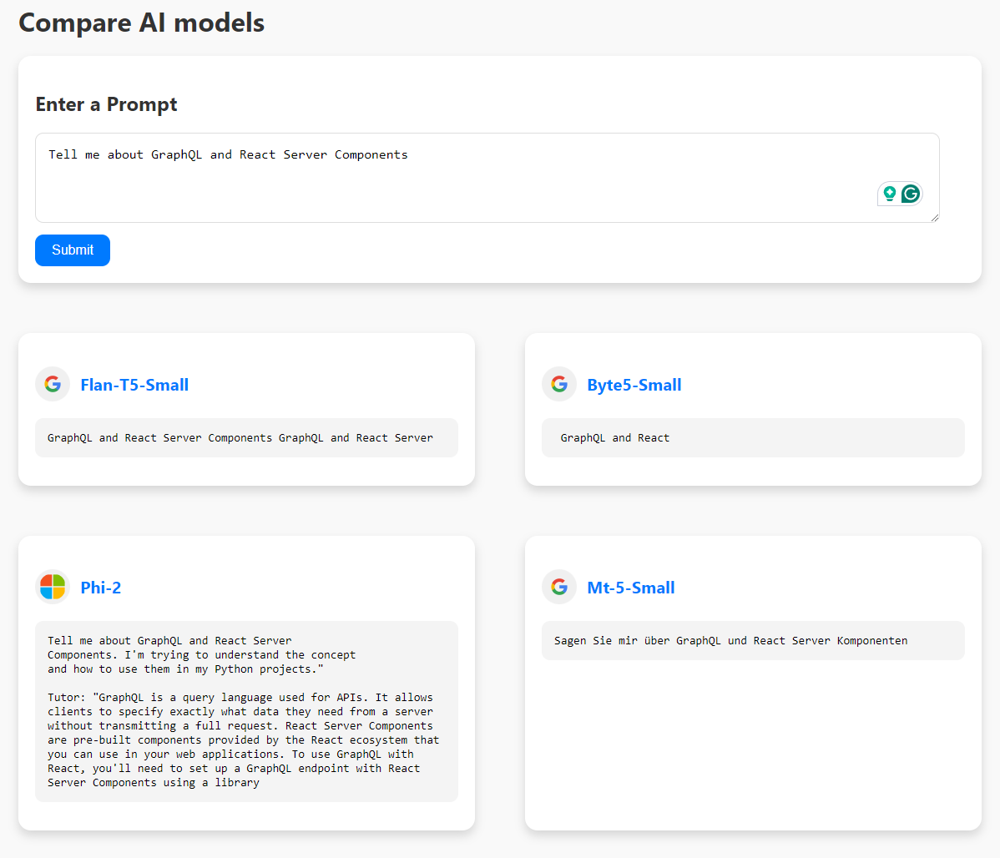

# huggingface-ai-compare

This app uses GraphQL to integrate multiple AI models for generating responses from user prompts. Users type a prompt, and the app queries different AI models like Flan-T5, Byte5, Phi2, and MT5. The results are displayed side-by-side for easy comparison. This is ideal for developers, researchers, and AI enthusiasts who want to test and compare different AI models for tasks like text generation and sentiment analysis. The app uses React for the frontend and Apollo Server for the backend, ensuring a fast and smooth user experience.



### Branches

- [🌿GraphQL branch](https://github.com/mo-sharif/huggingface-ai-compare/tree/feature/rsc-integration)
- [🌿React Server Components branch](https://github.com/mo-sharif/huggingface-ai-compare/tree/feature/graphql-integration)

### Start App

```
cd frontend
npm run start

cd backend
npm run start
```

### App Structure w/ RSC

See branches above for different app structures

```
my-app/
├── backend/
│   ├── src/
│   │   ├── config/
│   │   │   └── apis.js
│   │   ├── services/
│   │   │   └── apiRequest.js
│   │   ├── routes/
│   │   │   └── apis.js
│   │   ├── index.js
│   │   └── server.js
│   ├── .env
│   ├── package.json
│   ├── package-lock.json
│   └── README.md
└── frontend/
    ├── src/
    │   ├── components/
    │   │   ├── AIResults.server.js
    │   │   └── PromptInput.client.js
    │   ├── pages/
    │   │   └── App.server.js
    │   ├── App.js
    │   ├── index.js
    │   └── setupTests.js
    ├── public/
    │   └── index.html
    ├── package.json
    ├── package-lock.json
    ├── .babelrc
    ├── jest.config.cjs
    └── README.md
```

### Data Flow: Frontend to Backend without GraphQL

#### Frontend

1. **User Action Triggers Request:**

   - A user interaction, such as submitting a prompt through a form, initiates a data fetch request. This action is handled by a React component, like `PromptInput`.

2. **Send Request to Backend:**

   - The frontend uses the `fetch` API to send a POST request to the backend with the user's input. The request is directed to the appropriate backend endpoint.

3. **Manage Loading and Error States:**

   - The frontend manages loading states to indicate data fetching and error states to handle any issues during the request. It updates the state based on the response received from the backend.

4. **Receive and Display Data:**
   - Once the data is received, the frontend updates its state and re-renders the UI to display the results. Components like `AIResults` use the data to show the fetched results to the user.

#### Backend

1. **Receive Request:**

   - The backend, built with Express.js, has routes set up to handle incoming API requests. Each route corresponds to a specific service, like `flanT5Small`, `byt5Small`, `phi2`, or `mt5Small`.

2. **Process Request:**

   - The backend processes the incoming request by calling external APIs or services with the provided data. It uses modules like `node-fetch` to communicate with these services.

3. **Transform Data:**

   - The backend processes the responses from external services, transforming the data as needed to match the frontend's requirements.

4. **Send Response:**
   - After processing the request, the backend sends the transformed data back to the frontend. This response contains the results fetched from the external services.

By following these steps, the frontend and backend work together seamlessly to fetch, process, and display data based on user interactions.
